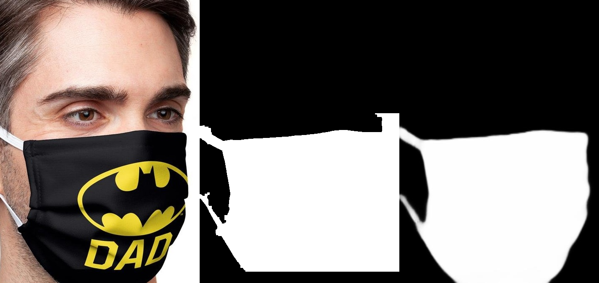
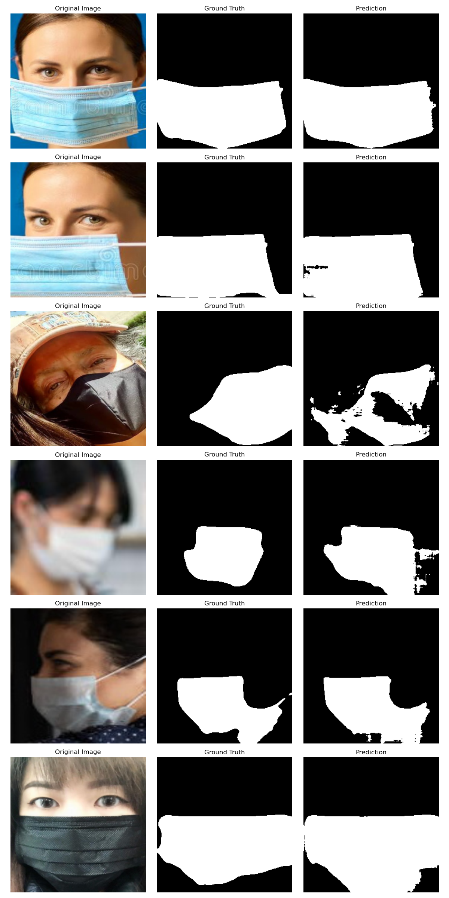

# Face Mask Detection and Segmentation

A comprehensive image processing project involving classification and segmentation tasks using both traditional and deep learning approaches.

## Table of Contents
- [Project Structure](#project-structure)
- [Dataset](#dataset)
- [Methodology](#methodology)
- [Installation](#installation)
- [Usage](#usage)
- [Results](#results)
- [Task-Specific Scores & Analysis](#task-specific-scores--analysis)
- [Future Improvements](#future-improvements)

## Project Structure
```
.
├── classification
│   ├── cnn_classifier.py  (Task 2: CNN Classification)
│   └── ml_classifiers.py  (Task 1: Traditional ML & NN Classification)
├── dataset
│   ├── data_download.py  (Dataset Download)
│   └── feature_extraction.py  (Feature Extraction)
├── main.py  (Main Pipeline Execution)
├── models  (Pretrained Models)
│   ├── best_unet_model.pth
│   ├── final_unet_model.pth
│   ├── ml_classification.pth
│   ├── model_adam_lr0003.pth
│   ├── model_adam_lr001.pth
│   ├── model_sgd_lr0005.pth
├── requirements.txt  (Project Dependencies)
├── results.txt  (Evaluation Results)
├── segmentation
│   ├── evaluate_model.py  (Evaluation of Segmentation Models)
│   ├── mask_segmentation.py  (Task 4: Deep Learning Segmentation - UNet)
│   └── traditional_segmentation.py  (Task 3: Traditional Segmentation)
└── utils
    └── variables.py  (Project-wide Constants)
```

## Dataset
This project utilizes two different datasets for the classification and segmentation tasks:

### Face Mask Detection Dataset
- **Source**: [GitHub - chandrikadeb7/Face-Mask-Detection](https://github.com/chandrikadeb7/Face-Mask-Detection/tree/master/dataset)
- **Used for**: Tasks 1 and 2 (Binary classification using ML classifiers and CNN)
- **Structure**:
  - Binary classification dataset organized in two folders:
    - `with_mask`: Contains approximately 2,156 images of people wearing masks
    - `without_mask`: Contains approximately 1,930 images of people without masks

### MFSD (Masked Face Segmentation Dataset)
- **Source**: Downloaded from Google Drive using the script in `dataset/data_download.py`
- **Used for**: Tasks 3 and 4 (Traditional segmentation and U-Net segmentation)
- **Structure**:
  - Contains original images of people wearing masks in `MFSD_dataset/MSFD/1/face_crop`
  - Includes pixel-level ground truth segmentation masks in `MFSD_dataset/MSFD/1/face_crop_segmentation`
  - Dataset information stored in `MFSD_dataset/MSFD/1/dataset.csv`

## Methodology
This project involves:
1. **Data Acquisition**: Downloading and preprocessing image data.
2. **Feature Extraction**: Extracting relevant features from images.
3. **Classification**: Using CNNs and traditional machine learning classifiers to categorize images.
4. **Segmentation**: Applying deep learning-based segmentation (UNet) and traditional segmentation techniques.
5. **Evaluation**: Analyzing classification and segmentation results using metrics such as accuracy, IoU, and Dice Score.

### Task 1: Traditional ML Classification
1. **Feature Extraction**:
   - HOG (Histogram of Oriented Gradients) features
   - LBP (Local Binary Patterns) features
   - Color histograms
   - Combined feature vector of 8404 dimensions

2. **Models Implemented**:
   - SVM with various kernels (rbf, sigmoid, linear) implemented using scikit-learn's SVC
   - Neural Network binary classifier with 3-layer architecture:
     - Input layer: 8404 dimensions
     - Hidden layer 1: 512 neurons with ReLU and 30% dropout
     - Hidden layer 2: 128 neurons with ReLU and 20% dropout
     - Output layer: 1 neuron with sigmoid activation
     - Trained with binary cross-entropy loss and Adam optimizer

### Task 2: CNN Classifier for Mask Detection
1. **Data Preparation**:
   - Split data into train (70%), validation (15%), and test (15%) sets using `split_dataset` function
   - Applied image augmentation:
     - Random horizontal flips
     - Random rotation (±10 degrees)
     - Resize to specified image size (default: 128×128 as defined in `variables.py`)
     - Normalization using statistics (mean=[0.485, 0.456, 0.406], std=[0.229, 0.224, 0.225])

2. **Model Architecture**:
   - Custom CNN architecture defined in `CNNClassifier` class with:
     - Three convolutional blocks:
       - Conv2D (3→32) + BatchNorm + ReLU + MaxPool + Dropout
       - Conv2D (32→64) + BatchNorm + ReLU + MaxPool + Dropout
       - Conv2D (64→128) + BatchNorm + ReLU + MaxPool + Dropout
     - Classifier head with dynamically sized input based on feature map dimensions:
       - Linear layer (calculated from feature maps → 256)
       - Output layer for binary classification

3. **Training Process**:
   - Three model configurations tested:
     - Adam optimizer (lr=0.001, weight_decay=1e-5), batch size 64, dropout 0.3, 30 epochs max, patience 15
     - SGD optimizer (lr=0.0005, momentum=0.9, weight_decay=1e-4), batch size 32, dropout 0.5, 30 epochs max, patience 20
     - Adam optimizer (lr=0.0003, weight_decay=1e-4), batch size 64, dropout 0.4, 40 epochs max, patience 20
   - Early stopping implemented to prevent overfitting

### Task 3: Traditional Segmentation
1. **Techniques Implemented**:
   - Face detection using Haar Cascade (`haarcascade_frontalface_default.xml`)
   - Region of interest (ROI) selection focused on lower face area
   - Color-based thresholding in HSV space for identifying common mask colors
   - Edge detection using Canny algorithm on Gaussian blurred images
   - Combination of color and edge-based approaches

2. **Post-processing**:
   - Morphological operations (opening, closing) to refine mask regions
   - Contour detection and filtering based on area and shape
   - Connected component analysis to remove small noise regions
   - Evaluation metrics calculation (IoU, precision, recall, F1 score)

3. **Visualization Examples**:
   
   **Good Segmentation Example**:  
   This example shows a case where traditional segmentation performs well, with good mask boundary detection and high IoU score.
   
   
   
   
### Task 4: U-Net Segmentation
1. **Model Architecture**:
   - Custom U-Net implementation defined in `UNet` class with:
     - Encoder path with 4 blocks: [3→64, 64→128, 128→256, 256→512]
     - Double convolution blocks with batch normalization and ReLU activation
     - Decoder path with skip connections from encoder
     - 2×2 max pooling in encoder and bilinear upsampling in decoder
     - Final 1×1 convolution and sigmoid activation for binary mask output

2. **Training Approach**:
   - Input images and masks resized to 256×256
   - Trained model loaded from checkpoint at epoch 10
   - Evaluated using IoU and Dice score metrics
   - Data loading with `SegmentationDataset` class for paired image-mask processing

3. **Visualization Results**:
   
   **U-Net Segmentation Comparison**:  
   The following image demonstrates the superior performance of U-Net segmentation compared to traditional methods. The visualization shows original images (left column), ground truth masks (middle column), and U-Net predicted masks (right column).
   
   
   
   As visible in these examples, U-Net consistently produces clean, accurate mask boundaries that closely match the ground truth masks, even in challenging cases with different mask types, colors, and lighting conditions. The high IoU (92.20%) and Dice (95.91%) scores reflect this qualitative observation.

## Installation
Ensure you have Python installed, then install dependencies:
```bash
pip install -r requirements.txt
```

Required packages include:
- numpy
- opencv-python
- scikit-learn
- pandas
- matplotlib
- torch
- torchvision
- gdown (for downloading datasets)
- tqdm
- Pillow

## Usage
Run the main pipeline with:
```bash
python main.py
```

For individual tasks:

1. **Task 1: Traditional ML Classifiers**
   ```
   python -c "from classification.ml_classifiers import main; main(extract=False, train=False)"
   ```

2. **Task 2: CNN Classifier**
   ```
   python -c "from classification.cnn_classifier import main; main(train=False)"
   ```

3. **Task 3: Traditional Segmentation**
   ```
   python -c "from segmentation.traditional_segmentation import main; main(100, download=False)"
   ```

4. **Task 4: U-Net Segmentation**
   ```
   python -c "from segmentation.evaluate_model import main; main()"
   ```

Parameters:
- `extract=True`: Extract features from raw images (Task 1)
- `train=True`: Train models from scratch instead of loading pre-trained ones
- First parameter in Task 3 (100): Number of images to evaluate
- `download=True`: Set to download datasets if not already present

## Results

### Task-Specific Scores & Analysis
#### Task 1 (Traditional ML & Neural Network Classification)
- **SVM Classifier Performance:**
  - RBF Kernel Accuracy: **93.53%**
  - Sigmoid Kernel Accuracy: **74.24%**
  - Linear Kernel Accuracy: **92.06%**
- **Neural Network Classifier Performance:**
  - Test Accuracy: **92.19%**
- **Observations:**
  - The RBF kernel performed best among SVM models due to its ability to map non-linear relationships.
  - The neural network classifier performed comparably to SVM but had the advantage of feature learning.

#### Task 2 (CNN Classification)
- **CNN Performance:**
  - `model_adam_lr001.pth`: **97.56% Accuracy**
  - `model_sgd_lr0005.pth`: **94.46% Accuracy**
  - `model_adam_lr0003.pth`: **97.07% Accuracy**
- **Comparison with Task 1:**
  - CNN significantly outperformed both traditional ML classifiers and the neural network implemented in Task 1.
  - Adam optimizer with learning rate `0.001` provided the best generalization.
  - CNN benefited from hierarchical feature extraction, improving classification accuracy.

#### Task 3 (Traditional Segmentation)
- **Segmentation Evaluation:**
  - Average IoU: **0.4636**
  - Precision: **0.5880**
  - Recall: **0.6596**
  - F1 Score: **0.5823**
- **Challenges:**
  - Traditional segmentation struggles with complex image features.
  - Heavily reliant on thresholding techniques which may not generalize well.
  - Performance varies significantly based on lighting conditions and mask color.

#### Task 4 (Deep Learning Segmentation)
- **UNet Segmentation Performance:**
  - IoU Score: **0.9220**
  - Dice Score: **0.9591**
- **Comparison with Task 3:**
  - UNet significantly improved segmentation quality due to its ability to capture spatial features.
  - Deep learning handles variations in lighting and background noise better than traditional methods.
  - The model demonstrates excellent generalization across different mask types and face orientations.

### Comparison: Classification vs. Segmentation
- **Classification Performance:**
  - CNNs (Task 2) performed **better** than traditional ML classifiers and the neural network in Task 1, achieving a higher accuracy.
  - Neural networks improved upon traditional ML approaches but required more data and tuning.
- **Segmentation Performance:**
  - UNet (Task 4) outperformed traditional segmentation (Task 3) due to its ability to recognize object boundaries more effectively.
  - Traditional methods had reasonable recall but lower precision overall.

### Pros & Cons
#### Classification
✅ CNNs generalize well with large datasets.  
✅ More robust to variations in image quality.  
✅ Neural networks in Task 1 improved upon traditional ML methods.  
❌ Requires more computational power than traditional ML classifiers.  
❌ Training deep models requires more data to prevent overfitting.  

#### Segmentation
✅ UNet effectively handles complex segmentation tasks.  
✅ Works well even with occlusions and overlapping objects.  
❌ Requires a large annotated dataset.  
❌ Training time and hardware requirements are high.  

## Future Improvements
- Improve segmentation accuracy with data augmentation.
- Optimize CNN architecture for better classification performance.
- Explore ensemble methods for improved classification accuracy.
